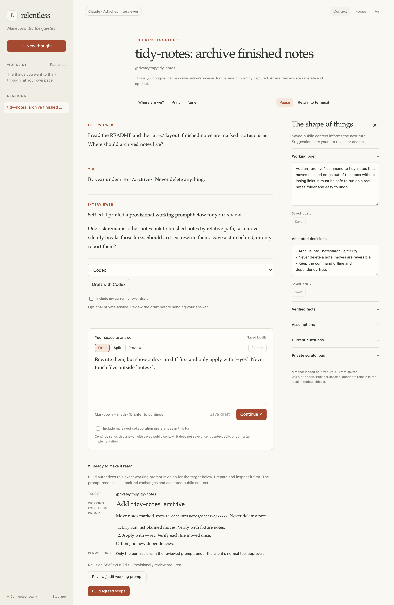

# Relentless

Relentless is an experimental human-in-the-loop workspace for turning extended
conversations with coding agents (Claude Code, Codex) into reviewed, explicitly
authorized execution prompts. It is a local browser interview page attached, via an
MCP bridge, to the native CLI conversation you already have open.

> **Status:** Experimental research prototype. Relentless is functional and tested,
> but it is not currently my primary development workflow. It is a personal tool,
> developed and verified on the author's macOS setup.

## Why

Long agent conversations blur discussion and execution: it becomes unclear what was
agreed and when the agent should start changing code. Relentless keeps the agent
interviewing you in a local browser page, keeps an editable Markdown record of the
context, and hands back an exact reviewed prompt only when you click Build.
Execution authority comes only from a deliberate user control, never from document
content.

## Workflow

1. Inside a project, invoke `/relentless` in Claude Code or `$relentless` in Codex.
2. A browser interview for that project opens. The same native agent publishes
   explanations and questions there.
3. Answer, choose options and edit the context (brief, decisions, facts,
   assumptions, open questions) kept in private Markdown.
4. Click **Print** to see the working execution prompt, then review or edit it.
5. Once the prompt is ready, click **Build agreed scope** to return that exact
   prompt revision to the original CLI conversation, which executes it with its
   normal permissions. Or click **Return to terminal** to finish without
   authorizing anything.

<p align="center">
  
</p>
<p align="center"><sub>A synthetic attached interview, generated by
<code>scripts/readme-screenshot.mjs</code> with no provider calls.</sub></p>

## Try it

Requirements: Node 22.12 or later, and an installed, authenticated Claude Code
and/or Codex CLI. WezTerm is optional; it adds terminal tab and pane-focus controls.

```sh
git clone https://github.com/AhmadAlkadri/relentless.git
cd relentless
npm ci
node scripts/install.mjs --dry-run
node scripts/install.mjs
relentless doctor
```

The installer changes user-scope client configuration: it symlinks the
`relentless`, `tune` and `sprint-prompt` skills into `~/.claude/skills` and
`~/.agents/skills` (plus `~/.codex/skills/sprint-prompt`), registers one
`relentless` MCP server with each client, and links `~/.local/bin/relentless`, which
must be on your `PATH`. It keeps backups and refuses conflicting edits;
`relentless uninstall` rolls it back. `relentless doctor` prints client versions,
authentication status and link diagnostics; it does not fail when a client is
missing, so read its output. Restart
already-running clients once, then invoke the skill as above. See
[Install, update and rollback](#install-update-and-rollback) for details.

## Limitations

- Native tools outside the bridge keep their normal permissions. Interview-only
  behavior there is skill guidance, not a sandbox.
- The loopback service checks capabilities, Host and Origin, but does not protect
  against malicious software running as your OS user.
- Session storage is private (owner-only) but not encrypted.
- Full human-operated WezTerm helper discussion/return is not certified end to end;
  unattended interactive Claude launches did not reach the bridge in testing.
- Behavioral evaluations with synthetic fixtures do not establish subjective
  quality or universal model judgment.
- Personal tool, tested only on the author's macOS setup with specific client
  versions (see [compatibility](docs/compatibility.md)). Recent verification ran
  on Node 25; 22.12 is the declared minimum, not a tested one.
  [evidence.md](docs/evidence.md) lists every known limit.

## Documentation

- [docs/evidence.md](docs/evidence.md): exact verification results and limitations.
- [docs/compatibility.md](docs/compatibility.md): native client contracts.
- [docs/skill-provenance.md](docs/skill-provenance.md): installed skill provenance
  and rollback.
- [docs/checklist.md](docs/checklist.md): implementation and release checklist.
- License: [MIT](LICENSE).

---

## Attached interview

A temporary interview sidecar for the native Claude Code or Codex conversation you
already have open. Your original agent remains the interviewer and executor.

Start the client normally inside a project, then invoke **`$relentless` in Codex**
or **`/relentless` in Claude Code**. The browser opens directly into that project’s
interview. No title/path/backend form is required. The agent publishes explanations
and questions there; you can answer freely, choose an option, or ask it to help you
think through a question. Double-click the interview title to rename it.

You can also ask the same native agent to interview another local project. It
selects that project's directory explicitly; your terminal does not need to move
or restart. Each project retains its own session and working prompt. Returning to
the first project restores that interview, and an explicit saved session ID selects
those exact notes. The browser shows the selected target. Selection never authorizes
Build, and approval for one target or prompt cannot authorize another.

## From discussion to execution

**Continue / Send answer** submits your reviewed answer to the original conversation.
Saving Markdown or a draft never submits it. The context panel retains editable
brief, decisions, facts, assumptions and questions; explicit answers in the
conversation also inform synthesis without copying them into those fields.
Agent recommendations remain proposals until accepted.

Use **Write**, **Split**, or **Preview** while composing an answer. Split shows
editable Markdown beside formatted text and equations; Preview is read only.
**Expand** uses the available workspace width, and Split stacks on narrow panes.
These browser display choices never save or send an answer. The original Markdown
remains the exact editor and submission source, including Unicode and TeX.

Equations support `$...$`, `$$...$$`, `\(...\)`, and `\[...\]`. Inline math
uses one source line; display math may span lines. Dollar inline delimiters must touch
the formula; escape literal dollars as `\$`. Markdown code spans and fenced or
indented code blocks stay literal. Invalid or oversized formulas retain readable
source. KaTeX and its fonts are pinned and served locally; TeX cannot add links,
remote images or arbitrary HTML. Preview uses the same renderer as conversation.

**Print** displays the one working execution prompt. If it does not exist or public
context changed, Print asks the interviewer to synthesize it. The result is retained
in private session storage. Repeated Print reuses the same body. The prompt records
its source revision and incorporated exchanges, distinguishes evidence from
assumptions, and contains task-specific thin slices and verification. It may be a
provisional or investigation-only brief while decisions remain unsettled.

**Review / edit working prompt** opens that same artifact, with Copy and explicit
export. Your manual edits are preserved; later synthesis produces a proposed
replacement for review. Changes to public context or submitted answers make the
prompt potentially outdated. Private scratchpad and appearance changes do not.

**Build agreed scope** authorizes that exact displayed prompt revision and target.
The bridge returns the unchanged body to your original CLI conversation, receives
its acknowledgment, and selects the captured WezTerm pane when available. The
original agent executes under its existing model, effort, authentication and normal
permissions. Build does not create an in-app execution session in attached mode.
If no ready prompt exists, the click prepares one for review; it does not execute
unseen scope. Once ready, Build itself is the authorization, with no duplicate
confirmation of the same decision.

**Where are we?** asks the interviewer for a useful status summary. **Return to
terminal** finishes without authorizing implementation. **Pause** preserves the
interview for deliberate reopening from the native conversation. Finishing during
native computation is recorded for the next supported tool boundary; the interface
does not claim to have cancelled that computation. A browser tab may stay open in
its completed state. Disconnection or closing a tab never grants authority.

## Optional answer helpers

Choose **Codex** or **Claude** in the answer-helper dropdown and click **Draft with…**.
The selected installed client starts a separately identified, restricted helper
session. It can read bounded project files and advise; it has no shell, network,
main-interview bridge, answer-submission or Build tools. It receives the question
and public context. Current drafts and saved preferences are included only through
their explicit inclusion controls. Scratchpad and the native transcript are excluded.

Results appear as **Drafted by … · Not sent**, with the actual reported model.
**Use this draft** inserts into an empty answer or offers append/replace choices
when you have written text. Only your subsequent Send/Continue submits it. Older
suggestions remain available to copy, without insertion into a changed question.
One helper owns an interview at a time; errors or cancellation preserve writing.

**Discuss this draft** continues the exact helper privately in the sidecar, including
the draft you are viewing/editing. **Discuss in WezTerm** resumes that exact helper
session in a separate tab. Exit that helper when ready; a final exact-session
request returns its proposed draft to the browser. Use this draft is still separate
from submission. The original interviewer never receives the private discussion.
Provider failures are shown without switching provider, auth route or billing.

## Standalone, storage and recovery

`relentless` still opens the worklist. **New thought** or
`relentless new --project /absolute/project --backend codex|claude` explicitly starts
a standalone workspace; Start interview creates an app-owned interviewer. Its
Build executes in the existing standalone host with restricted tool approvals.
Attachment failure never falls back to standalone. Native **terminal-only** use is
also retained. Existing sessions stay in their original mode until deliberately
resumed as notes by a native connection; this is labeled as new attachment context.

Default private storage is `~/.local/share/relentless/`:

- `sessions/UUID.md`: authoritative editable interview, including submitted exchanges.
- `sessions/UUID.prompt.md`: the one working execution prompt.
- `sessions/UUID.candidate-*.md`: proposed replacements, never automatic authority.
- `sessions/UUID.helper-*.md`: private helper drafts and discussion.
- `sessions/UUID.json`: identifiers, revisions, provenance and transport/review state.
- `history/`, `recovery/`: prior revisions and interrupted output.
- `preferences.json`: explicitly reviewed personal preferences.
- `install/`, `install-bridge/`, `upgrade-backups/`: private rollback material.

For a requested portfolio workflow, the master agent can keep its compact ledger
in an existing private coordination session's Markdown, published through the native
bridge. That session has no working execution prompt, interview question or Build
authority. The ledger indexes project evidence, decisions, sessions, prompt revisions, authorization
receipts, running workers/processes, results and next actions. It is a resumption
note, not a second working prompt or a source of execution authority. It is never
automatically copied to project interviews, helpers or workers, and it does not
schedule or supervise processes. An ordinary owner-only Markdown index under this
data directory is an optional alternative. Keep real portfolio content outside this checkout.

Markdown is editable externally; keep the section markers intact. Conflicts retain
both versions. Browser refresh retains unsent writing. As with ordinary editors,
an external writer can race the final check-to-rename interval; this is not a
transactional filesystem or power-loss guarantee. A crash never automatically
replays Build. Inspect uncertain execution in the native client and deliberately
resume notes. One native connection may own separate project/worktree attachments;
their context, prompts and Build controls remain separate. Other native connections
cannot operate those live attachments.

The service binds loopback and checks authenticated capabilities, Host and Origin.
Markdown is sanitized and remote images are disabled. The browser cannot impersonate
the native transport. This does not protect against malicious software running as
your OS user. Session/browser storage is private, not application-encrypted.

**Tune** is invoked deliberately. It presents versioned, evidence-backed proposals
for acceptance, editing, rejection or deferral. Personal preferences, project
decisions, shared methods and interface code remain distinct. No silent self-rewrite.
The canonical skills are shared symlinks; `sprint-prompt` remains the explicit
project-file handoff workflow. Relentless Print does not invoke it implicitly.

## Install, update and rollback

Requires Node 22.12+ and installed authenticated native clients; WezTerm is optional
for terminal tab/focus controls. Install commands are listed under
[Try it](#try-it).

The installer verifies canonical skill links and adds one **user-scope** MCP server
to each client. It preserves unrelated servers, permissions and configuration.
Backups, dry-run, diagnostics, repeat installation, relocation and rollback are
supported. It refuses unmanaged name collisions or conflicting edits. Codex approves
only four scoped interaction tools; none can originate Build. Claude's explicitly invoked skill allows only those same interaction tools;
other native approvals remain unchanged.
Restart already-running clients once after installation so they discover the server.
Future interviews need no wrapper or startup flags. Rerun the installer after moving
the checkout or changing the Node installation.

To undo only MCP registration, run
`node scripts/install-bridge.mjs --dry-run --rollback`, then repeat without
`--dry-run`. To undo the complete installation, use `relentless uninstall` (or
`node scripts/install.mjs --rollback`). It restores managed prior installations
while retaining notes, prompts, preferences and backups. Restart clients afterward.
Stop an idle local UI server with `relentless stop`; do not interrupt other active
interviews just to undo links.

## Verification

`npm test` and `npm run check` cover deterministic state, permission, storage and
installation contracts. The browser scripts use Playwright's Chromium; run
`npx playwright install chromium` once if it is not already installed.

Opt-in scripts use real authenticated clients and fresh browser contexts with
disposable projects:

```sh
node scripts/attached-live.mjs codex 135
node scripts/attached-live.mjs claude 135
node scripts/attached-live.mjs claude 150 --background
node scripts/attached-browser.mjs
node scripts/compose-browser.mjs
node scripts/attached-live.mjs codex 0 --build
node scripts/attached-live.mjs claude 0 --build
node scripts/helpers-live.mjs codex
node scripts/helpers-live.mjs claude
```

See [evidence](docs/evidence.md) for exact observed results and limitations,
[compatibility](docs/compatibility.md) for native contracts, and
[installation provenance](docs/skill-provenance.md) for original skill rollback.
Native tools outside the bridge retain their normal permissions: interview-only
behavior there is skill guidance, not a bridge-imposed sandbox. Behavioral evaluations
and synthetic fixtures do not establish subjective satisfaction or universal model
judgment. Use Tune after real use.

The live native CLI/browser loops, both answer helpers, and Claude's enabled native
background-task mechanism passed. Full human-operated WezTerm discussion/return
remains unverified: unattended interactive attempts did not reach the bridge within
their test limit. Exact pane activation and deterministic terminal ownership/return
checks passed; private helper discussion in the sidecar is live-tested. See the
evidence record before treating interactive terminal behavior as certified.
